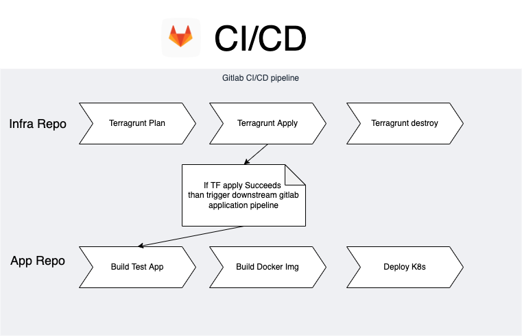
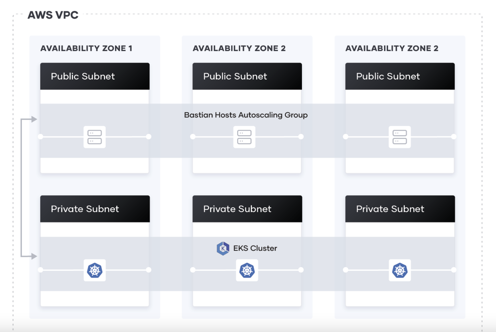

# Sample-go-app deployed to EKS cluster using Terraform and Gitlab

Deploy GO application to EKS using Terraform and Gitlab

## Getting started

Deploy app & infra from local system.

**Pre-requiste:**

1. AWS Account
2. Create IAM user download access key and secret key
4. Docker, Kubectl, Terraform & Terragrunt installed on local system
5. Install `base-iam-authenticator` on your local system

Clone the repo with https option.

**Setup Infrastructure:**

1. Setup AWS CLI with access key and secret key
2. Go to `infrastructure` directory and configure `profile` and `region` local variables in `terragrunt.hcl` file
3. Initialize terragrunt setup with command `terragrunt init` (This initiate terraform S3 & dynamo db backend creation)
4. Once `terragrunt init` command is executed without any error then run `terragrunt plan`
5. Finally run `terragrunt apply` command to deploy infrastructure.


Once the infra is ready you can proceed to creating and deploying application.

First connect to EKS cluster using command
`aws eks --region <region> update-kubeconfig --name <cluster_name> --profile default`
then follow below steps to build and deploy application.


**Setup/Deploy Go App:**

1. Build Docker image and push it to ECR repo (ECR repo link can be found in outputs of terragrunt)
  - `aws ecr get-login-password --profile <default>| docker login --username AWS --password-stdin <ECR_REPOSITORY>`
  - `docker build -t <ECR_REPOSITORY>:latest .`
  - `docker push ${ECR_REPOSITORY}:latest`
2. Deploy application and service
  - `kubectl -f deployment.yml`
  - `kubectl -f service.yml`


**Cleanup everything:**

- First clean up all Kubernetes deployments/services using `kubectl delete --all services` or `kubectl delete deployment <deployment-name>`
- Once deployments and services are cleanup then delete infrastructure using following commands:
  - `terragrunt init`
  - `terragrunt destroy`

## CI/CD Architecture ideas

- CI/CD pipeline can be pepared for both infra and application where infra will have a ci/cd pipeline with an upstream pipeline which handles deployment of latest application image




## Future updates and features

- CI/CD pipeline for infra aswell as application couple together to give a single interface and overview of whole release pipeline.
- MR based CI/CD pipeline triggers on Gitlab
- Role based authentication for terragrunt &  CI/CD pipelines
- Kubernetes dashboard or any monitoring solution for resource optimization


## Advantages of this setup

- Multi AZ EKS setup - highly available across a given region



- Clean and unified overview of whole CI/CD pipeline on Gitlab
- Auto-scalable & Auto rollback deployments
- Infrastructure state maintained via Terraform remote state on S3 & Dynamo DB
- Application Docker image is stored on ECR
- Docker in Docker based CI/CD pipelines for lightweight and quick builds aswell as deployments.


## Disadvantages of this setup

- High maintainence - one has to always update and upgrade terrafrom and terragrunt versions
- Solution tightly coupled with AWS and Gitlab (Prone to downtimes based on provider status)
- High costs (you pay for Gitlab services and AWS services)


## FAQ

Incase you face error: `You must be logged in to the server (Unauthorized)`


This happens because the user you are using to connect to the cluster is not whitelisted in configmaps to allow access. Please add the IAM users to kubernet config map using below commands.

- See config map using: `kubectl -n kube-system get configmap aws-auth -o yaml`
- Edit config map using: `kubectl -n kube-system edit configmap aws-auth`

Add following section after `mapRoles`

```
  mapUsers: |
    - userarn: arn:aws:iam::XXXXXX:user/test_user
      username: test_user
      groups:
        - system:masters
```

This will let external IAM users or roles access cluster from anywhere.

## References

- [Provision an EKS Cluster (AWS)](https://learn.hashicorp.com/tutorials/terraform/eks?in=terraform/kubernetes)